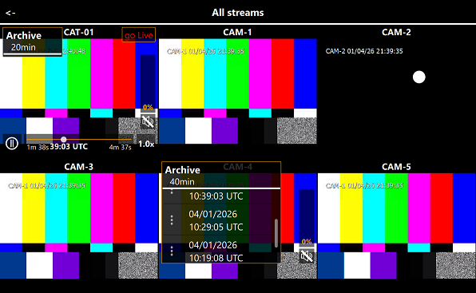

<h1 align="center">
	<a href="https://github.com/In-spectrum/CamOnTime" target="_blank">
    	
	</a>
	<br>
	<a href="https://github.com/In-spectrum/CamOnTime" target="_blank">
		Personal streaming media service
	</a>
</h1>

<br>

**Purpose**
* to create personal media service for viewing, recording RTSP streams from video cameras;
* share the video stream with other users;
 
**Application was tested**
* <a href="https://github.com/In-spectrum/CamOnTime/releases" target="_blank">Windows 10, Ubuntu 20.04.6, Android 11;</a>

**Planned**
* iOS, macOS;

**Video preview**
<p align="center">
  <a href="https://in-spectrum.github.io/CamOnTime/manual/videos/demo.mp4">
    
  </a>
</p>


## Table of contents

* [**CamOnTime-server**](#CamOnTime-server)
  * [Functions](#functions)
  * [Properties](#properties)
  * [Install](#install)
* [**CamOnTime-client**](#CamOnTime-client)
  * [Functions](#functions-1)
  * [Install](#install-1)
  * [Stream test](#stream-test)
* [**Installing additional software**](#installing-additional-software)
* [**Application archive**](https://github.com/In-spectrum/CamOnTime/releases)
* [**Contacts**](https://github.com/In-spectrum/Porfolio/)
* [**License**](#license)

## **CamOnTime-server**
### Functions  
  &emsp;&nbsp;- user registration;
  <br>&emsp;&nbsp;- recording video files;
  <br>&emsp;&nbsp;- user access to cameras and files (depending on the status);

### Properties
**-pas** - set server password (default: 1111); _**CamOnTimeServer -pas 2227**_<br>
**-p** - set listen port (default: 1255); _**CamOnTimeServer -p 1675**_<br>
**-prtsp** - set rtsp-server port for viewing video files (default: 8354); _**CamOnTimeServer -prtsp 8654**_<br>
**-f** - set path to video files folder (default: home/user_name/Video); _**CamOnTimeServer -f D://VideoBox**_<br>

### Install
 - [GStreamer install](#installing-additional-software);
 - download <a href="https://github.com/In-spectrum/CamOnTime/releases" target="_blank">application archive</a> and unzip;
 - start the server with parameters: **_CamOnTimeServer -pas 2227 -p 1675 -prtsp 8654_**

## CamOnTime-client
The administrator create users and has access to all cameras.

### Functions
- adding/deleting RTSP stream of camera;
- simultaneous viewing of several video cameras;
- setting the total time for recording files;
- setting the status of the video camera as publicly available for all users on the server;
- generating code for viewing the video camera by clients who are not connected to the server but have the application installed;
- copy/delete files;

### Install
 - [GStreamer install](#installing-additional-software);
 - download <a href="https://github.com/In-spectrum/CamOnTime/releases" target="_blank">application archive</a> and unzip;
 - start the CamOnTime;

### Stream test
Copy the token and paste to menu: **'Stream add (token)'**  
  
**Сamera free tokens:**  
```bash
X8195pAzTl,migf#r+)@4fcmi1{9)!.mq00501512Q20500601q125
```
```bash
A9AwpEHx19rny($uy)cjzgs.'&%7cktn500610510500511Q215005
```
   
## Installing additional software
### &emsp;**Windows:**
- download installation files: <a href="https://gstreamer.freedesktop.org/data/pkg/windows/1.26.9/mingw/" target="_blank">gstreamer-1.0-mingw-x86_64-1.26.9.msi и gstreamer-1.0-devel-mingw-x86_64-1.26.9.msi</a>;
- run with administrator rights;
- select **Custom** and **check all plugins**;
- add __C:\gstreamer\1.0\mingw_x86_64\bin__ to **PATH** system;
- if after run the application there is an error with **libgst3d11.dll** or **libgst3d12.dll** - delete them from __C:\gstreamer\1.0\mingw_x86_64\lib\gstreamer-1.0__

### &emsp;**Ubuntu:**
```bash
#sudo apt-get update && upgrade
```
- GStreamer plugins:
```bash
#sudo apt-get install gstreamer1.0-plugins-base gstreamer1.0-plugins-good gstreamer1.0-plugins-bad gstreamer1.0-plugins-ugly gstreamer1.0-libav gstreamer1.0-rtsp libgstrtspserver-1.0-0 libgstrtspserver-1.0-dev -y
```

## License
All code in this repository is released under the <a href="https://github.com/In-spectrum/CamOnTime/blob/main/LICENSE">MIT license</a>. 
<br>Application archives and compiled binaries make use of some third-party dependencies:
- Qt - the primary <a href="https://www.qt.io/licensing/open-source-lgpl-obligations#" target="_blank">open-source license</a> is the GNU Lesser General Public License v.3 <a href="https://www.gnu.org/licenses/lgpl-3.0.txt" target="_blank">“LGPL v3”</a>;
- GStreamer - <a href="https://github.com/GStreamer/gstreamer/blob/main/LICENSE" target="_blank">licensed under the LGPL v2.1;
